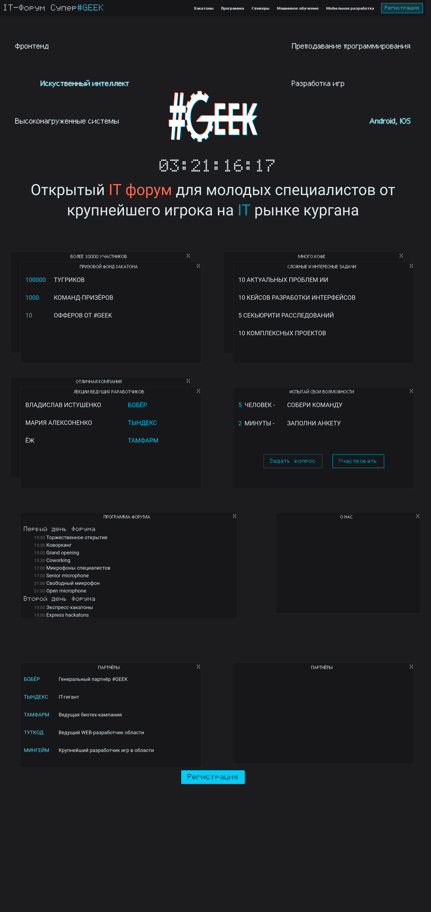

This code is not meant to be used as an example of anything.

It was developed in rage of a 2-day hackaton,
and there are a lot of architectural decisions and implementations that don't make me proud.

Landing is translated for RU/EN, language is autodetected from browser.

Stack:

- Svelte4 + Sveltekit
- Skeleton on Tailwindcss with Postcss + FloatingUI
- Svelte-preprocess
- Svelte-i18n
- Prisma
- MariaDB

A lot of display data is fetched from database

Registration form pushes data into the database

And yep, those tiny windows are draggable

The source code is released under terms of GNU Affero General Public License.

The logo is released under terms of GNU Affero General Public License.

So if you wanna use derivative, keep an eye to have Github source code link.
